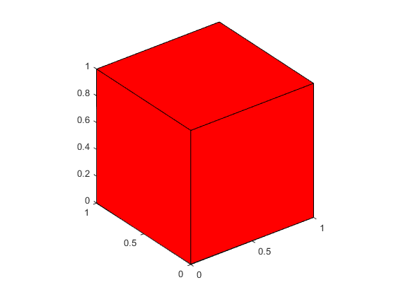
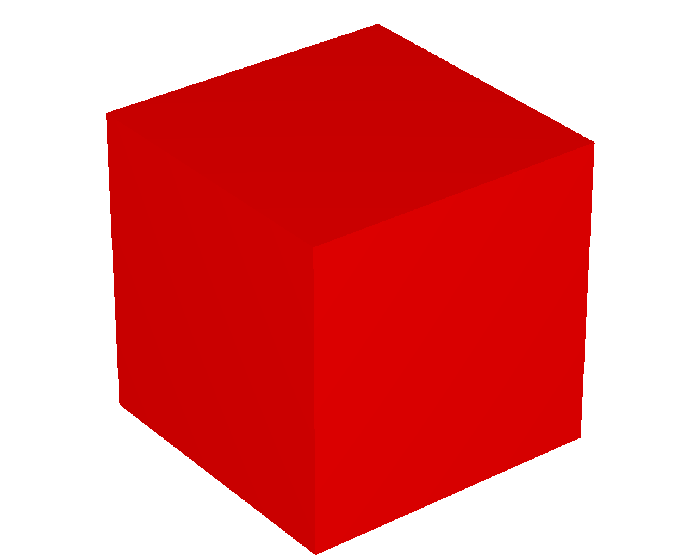
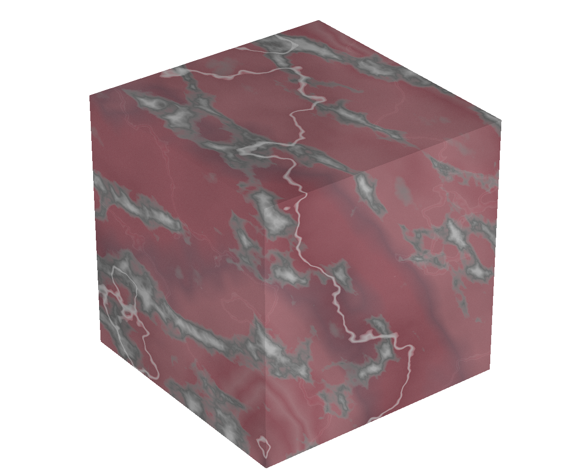
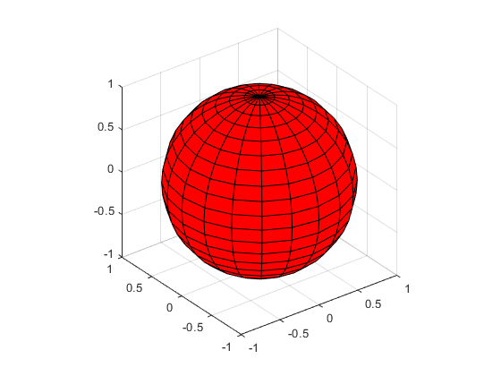
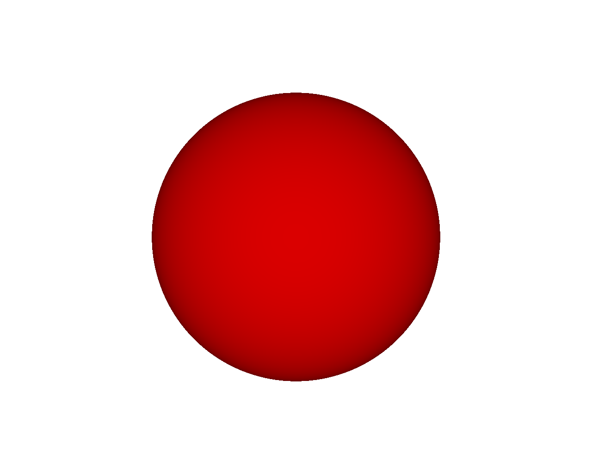
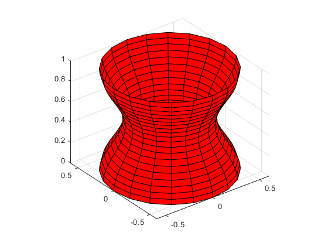
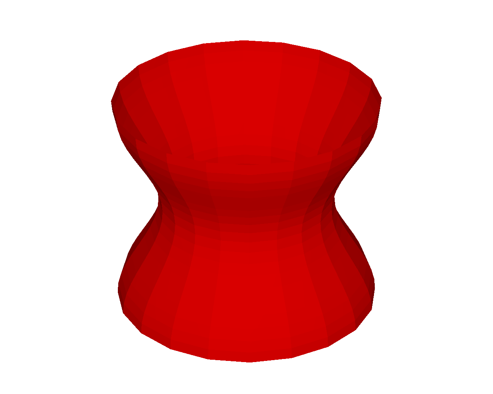
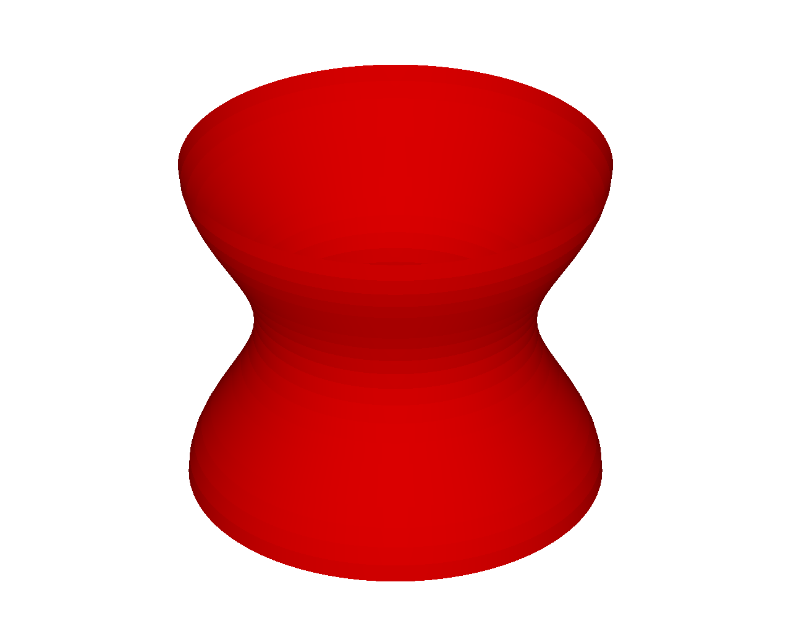

# fig2pov: Convert MATLAB figure to Povray script
## Introduction
MATLAB graphics uses openGL (or ...) for rendering. The quality of the rendering is not as good as what can be provided by e.g ray tracing. Povray is a popular open-source ray tracing program with its own scripting language for describing scenes.
This function provides a simple way to convert MATLAB figures (or, to be exact, axes) to images rendered using ray tracing. It does so by generating a povray script based on the contents of the axes object. This script can be executed in Povray to gemerate the image.

## Usage
After you've generated an axes object with all the graphics elements you want, this figure can be converted to a Povray script by simply calling:
```
fig2pov(_h\_axes_, _script\_name_)
```
With:
- _h\_axes_ the handle to the axes object you want to convert (use gca for most recent axes)
- _script\_name_ the name you would like for the generated script

If no arguments are provided, the default values are _h\_axes_ = gca and _script\_name_ = 'fig.pov'.

To see the rendered version, you will have to execute this script in Povray. The program is free and can be downloaded here: xxxxxxxxxxx

## A first example
Consider a red cube, drawn using MATLAB graphics objects:
```
cube = patch('Vertices',[0 0 0; 0 0 1; 0 1 0; 0 1 1; 1 0 0; 1 0 1; 1 1 0; 1 1 1], ...
	 'Faces',[1 2 4 3; 5 6 8 7; 1 2 6 5; 3 4 8 7; 1 3 7 5; 2 4 8 6], ...
	 'FaceColor', [1 0 0]);
view(3)
axis equal
```
The code above will result in the following figure:



Next, call fig2pov to convert this figure into a Povray script: 
```
fig2pov(gca, 'cube.pov')
```
The working directory will now contain a file called 'cube.pov', which is a file in the Povray scripting language. The \*.pov format is readable and can be edited in any text editor. To render the image, the script has to be executed by Povray. Make sure Povray is installed and call it from either the command line or using the GUI version. 
```
povray cube.pov
```
In this case, the script will result in the following figure:



## Other graphics objects
In the first example, the only graphics object in the axes was a patch object. fig2pov will convert all graphics objects, including surfaces, lights and lines. If an axes object contains multiple objcets, all of them will be included in the generated Povray script.
### Surface

### Lines
Povray is a ray-tracing program. As such, it has no concept of "lines". Instead, lines are converted into thin cylinders.

### Mix of objects

## Using Povray options
In addition to a straightforward conversion from the MATLAB figure to a ray-traced image, it is possible to specify additional properties and options for the graphics objects. This will enable rendering options that are not natively suported in MATLAB itself, such as adding etxture to patch objects, shadowing, ... 

Each graphics object in MATLAB has a property/field call 'UserData'. This field has no predefined structure and can be used to add data of any kind to the object. Note that each object (inclduing figures and axes) has its own 'UserData'. To provide povray-specific instructions for a graphics object, add a field 'povray' to UserData. UserData.povray is interpreted as a structure and its fields specify additional rendering instructions.
Some examples are given below.

### Adding Texture
MATLAB can add texture to surface objects, but no to other graphics objects. Povray has very rich texturing capabilities.
Let's start again from the cube:
```
cube = patch('Vertices',[0 0 0; 0 0 1; 0 1 0; 0 1 1; 1 0 0; 1 0 1; 1 1 0; 1 1 1], ...
	 'Faces',[1 2 4 3; 5 6 8 7; 1 2 6 5; 3 4 8 7; 1 3 7 5; 2 4 8 6], ...
	 'FaceColor', [1 0 0]);
view(3)
axis equal
```
Adding texture using povray is done by adding the proper instructions to cube.UserData:
```
cube.UserData.povray.Texture = 'T_Stone21';
``` 
'T_Stone21' is one of the many texture recognized by Povray. A full list can be found in xxxx, including stone, wood, metal, glass, ... finishes.
Once the structure 'povray' with field 'TexTure' is added to cube, fig2pov can be called to generate the povray script:
```
fig2pov(gca, 'cube.pov')
```
Executing 'cube.pov' in Povray gives the following figure:


### Adding background
By default, the color of the background will be the same as the color used for the axes object.

### Adding a plane

### Optimizing rendering of spheres and cylinders
In MATLAB, patch and surface objects are really collections of polygons, even if the intention is to draw a sphere or a cylinder. The appearance of "roundness" is obtained by using large numbers of faces.
Povray natively supports commands that draw smooth spheres or cylinders (or any object with a rotation axis). If we know that an object is a sphere or has an symmetry axis, we can include this information in UserData.povray. fig2pov will then use the appropriate povray commands, rather than treating the object as a collection of faces.

Consider a red sphere in MATLAB:
```
[x,y,z]=sphere;
h_sphere = surf(x, y, z, 'FaceColor', 'r')
view(3)
axis equal
```



The faces are clearly visible and will remain visible when using fig2pov:


We can let fig2pov know to treat the graphics object as a sphere by adding:
```
h_sphere.UserData.povray.drawAsSphere = true;
```
With this, the rendered image will look like:


Likewise, a similar command can be used for cylinders. Note that the MATLAB command 'cylinder' means any object that is formed by rotation a curve around the z-axis. For example:
```
t = 0:pi/10:2*pi;
[x, y, z] = cylinder(0.5+0.1*cos(t));
surf(x, y, z, 'FaceColor', 'r')
axis equal
```







### Defining povray properties

## List of povray options
Below are all options that can be added to UserData.povray to specify rendering options that may not be supported by MATLAB.

Texture
InteriorTexture
TextureScale
Define
ShadowLess
Plane
PlaneColor
PlaneTexture
drawAsSphere
drawAsCylinder
FaceColor
FaceAlpha
drawEdges
EdgeColor
EdgeTexture
MarkerFaceColor
MarkerTexture
SmoothingOn
MeshOn


