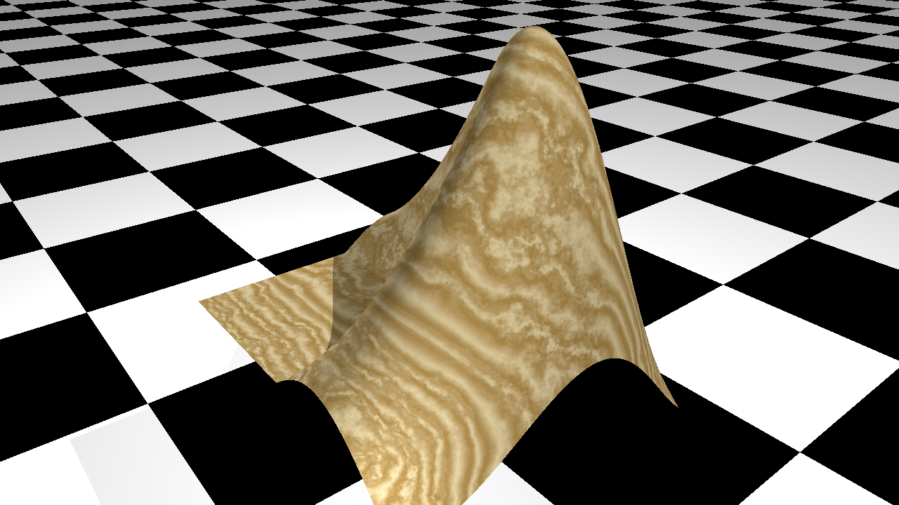
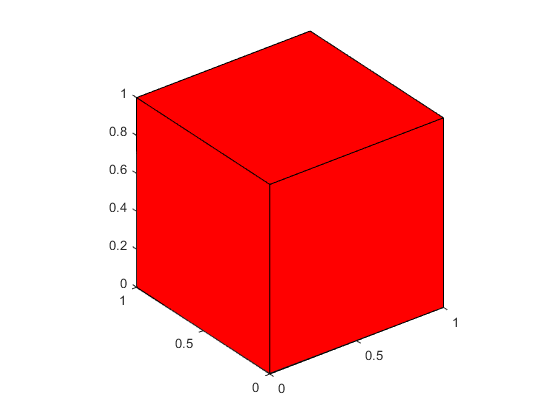
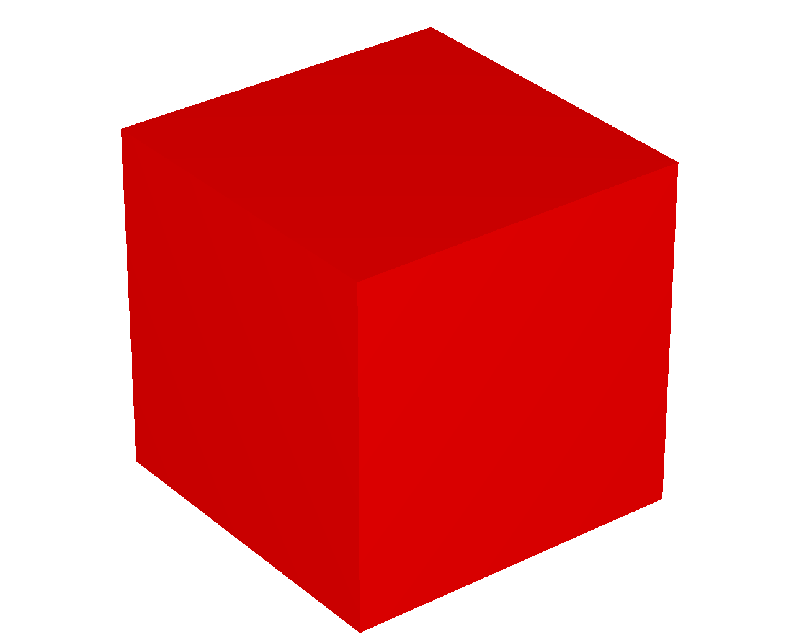
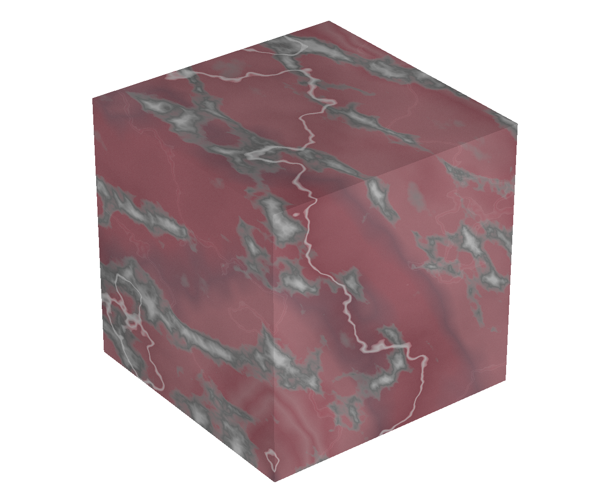
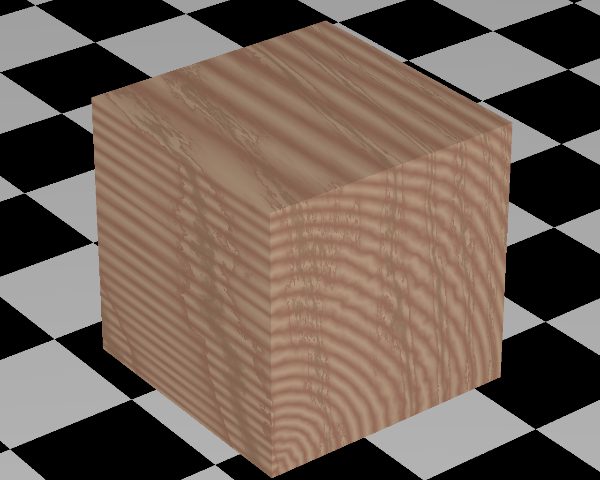

<p align="center">  </p>

# fig2pov: Convert MATLAB figure to Povray script
## Summary
Convert MATLAB figures to ray-traced images using Povray as the rendering engine. If desired, add texture and other rendering elements not supported by MATLAB to your graphics objects.

## Introduction
MATLAB graphics uses openGL or Painters for rendering figures. The quality of the rendering is not as good as what can be provided by e.g ray tracing. Povray is a popular open-source ray tracing program with its own scripting language for describing scenes.
This function provides a simple way to convert MATLAB figures (or, to be exact, axes) to images rendered using ray tracing. It does so by generating a povray script based on the contents of the axes object. This script can then be executed in Povray to generate the final image.

## Usage
After you've generated an axes object with all the graphics elements you want, this figure can be converted to a Povray script by simply calling:
```
fig2pov(h_axes, script_name)
```
With:
- _h\_axes_ the handle to the axes object you want to convert (use gca for most recent axes)
- _script\_name_ the name you would like for the generated script

If no arguments are provided, the default values are _h\_axes_ = gca and _script\_name_ = 'fig.pov'.

To see the rendered version, you will have to execute this script in Povray. The program is free and can be downloaded here: 
https://www.povray.org/download/


## A first example
Consider a red cube, drawn using the MATLAB patch object:
```
cube = patch('Vertices',[0 0 0; 0 0 1; 0 1 0; 0 1 1; 1 0 0; 1 0 1; 1 1 0; 1 1 1], ...
	 'Faces',[1 2 4 3; 5 6 8 7; 1 2 6 5; 3 4 8 7; 1 3 7 5; 2 4 8 6], ...
	 'FaceColor', [1 0 0]);
view(3)
axis equal
h_axes = gca;
```
The code above will result in the following figure:

<p align="center">  </p>

Next, call fig2pov to convert this figure into a Povray script: 
```
fig2pov(gca, 'cube.pov')
```
The working directory will now contain a file called 'cube.pov', which is a file in the Povray scripting language. The \*.pov format is readable and can be edited in any text editor. To render the image, the script has to be executed by Povray. Make sure Povray is installed and call it from either the command line or using the GUI version. 
```
povray cube.pov
```
In this case, the script will result in the following figure:

<p align="center">  </p>

## Adding texture and other elements
The appearance a graphics object can be further changed by adding a structure named 'povray' to the UserData of that object.
For instance, with 'cube' being the handle of the patch created earlier:
```
cube.UserData.povray.Texture = 'T_Stone21';
``` 
When calling fig2pov, the same cube will now be rendered with a texture named 'T_Stone21', giving the following figure:

<p align="center">  </p>

See [here](./Documents) for available textures.

Each graphics object can have its own 'UserData.povray' structure:
```
cube.UserData.povray.Texture = 'T_Wood1';
h_axes.UserData.povray.Plane = [0 0 1 -5];
h_axes.UserData.povray.PlaneColor = 'checker color Black, color White';
``` 
This gives:

<p align="center">  </p>

See the documentation (./Documents/fig2pov documentation.docx) for more details on the extra options that can be specified.

## Multiple graphics objects
If an axes object contains multiple graphics objects, all of them will be included in the Povray script.

For example, five randomly placed spheres with different radii and randomly selected textures:
```
figure
hold on
[x,y,z] = sphere;
for i=1:5
    rand_pos = randi([-2 2], 1, 3);
    rand_scale = 0.5*rand + 1;
    h_sphere(i)=surf(rand_scale*x+rand_pos(1),rand_scale*y+rand_pos(2),rand_scale*z+rand_pos(3));
    h_sphere(i).UserData.povray.drawAsSphere = true;
    h_sphere(i).UserData.povray.Texture = sprintf('T_Stone%d', randi([1,44],1,1));
end
view(3)
axis equal
h_axes = gca;
h_axes.UserData.povray.Plane = [0 0 1 -4];
```

This gives the following figure after rendering in Povray:

<p align="center">  </p>

## Note
These functions were initially written to facilitate the generation of pictures of polyhedra (using mostly patch objects). Since then, I've tried to include other types of graphics objects as well. Let me know if something is missing or you find bugs.
